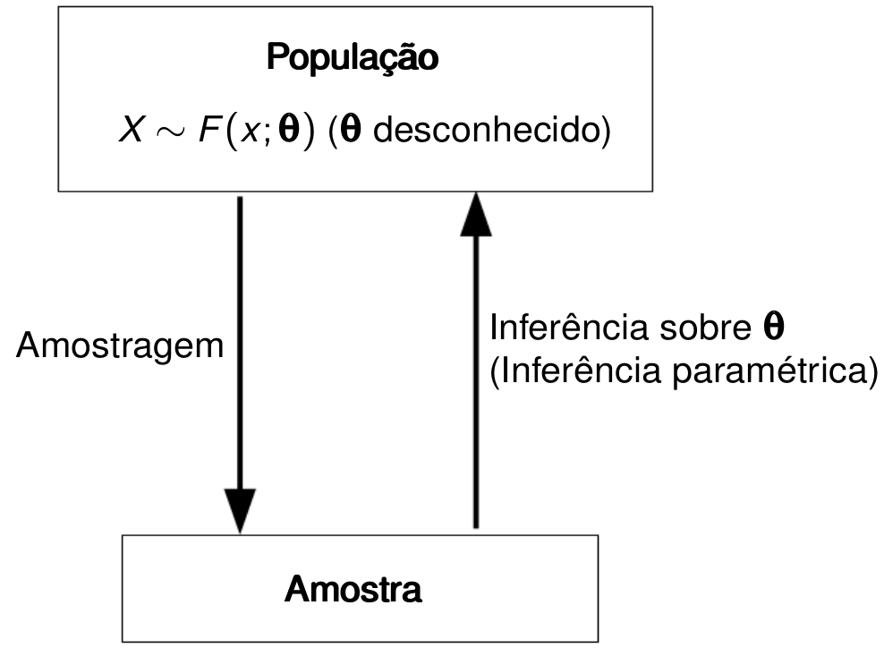

```{r xaringan-themer, include = FALSE}
# install.packages(c("xaringan", "devtools"))
# devtools::install_github("gadenbuie/xaringanthemer")
library(xaringanthemer)
mono_dark(
  base_color = "#FF7100",
  header_font_google = google_font("Josefin Sans"),
  text_font_google   = google_font("Barlow", "400", "400i"),
  code_font_google   = google_font("Droid Mono"),
)
```

background-position: 100% 0%
class: inverse, center, middle

# Um pouco sobre mim


---
background-image: url("img/logo-branca.png")
background-size: 100px
background-position: 100% 0%

# Minha formação

</br></br></br></br>

- Crusei o **bacharelado** em estatística no Departamento de Estatística - UFPB entre os anos de 2006 à 2010.</br></br>

--

- Fui discente do programa de pós-graduação (**mestrado**) em estatística no Departamento de Estatística - UFPE entre os anos de 2012 à 2014.</br></br>

--

- Fui discente do programa de pós-graduação (**doutorado**) também em estatística no Departamento Departamento de Estatística - UFPE entre os anos de 2014 à 2016.

---
background-image: url("img/logo-branca.png")
background-size: 100px
background-position: 100% 0%

# Minha formação

--

**MESTRADO**

--

No mestrado trabalhei desenvolvendo estratégias em inferência intervalar aplicadas à **modelos** de regressão utilizando métodos estatísticos computacionalmente intensivos. Fui orientado pelo Prof. Francisco Cribari Neto do Departamento de Estatística da UFPE.

--

Título da dissertação: **Estimadores Intervalares Sob Heteroscedasticidade de Forma Desconhecida Via Bootstrap Duplo**.

Link da dissertação: clique [**aqui**](https://www3.ufpe.br/ppge/images/dissertacoes/dissertacao130.pdf).

--

**DOUTORADO**

--

No doutorado desenvolvi trabalhos na área de probabilidade com foco na obtenção de novas famílias de distribuições de probabilidade. O trabalho concentrou-se no desenvolvimento de propriedades matemáticas (inferência estatística) dos **modelos** propostos bem como foi desenvolvido bibliotecas computacionais para uso da comunidade científica que trabalha na área de distribuições de probabilidade.

--

Título da tese: **Some New Families of Continuous Distributions**.


Link da tese: clique [**aqui**](https://www.ufpe.br/documents/39866/714959/tese020.pdf/6f867756-1954-4ea1-8b01-e9077c1bd7f2).

---
background-image: url("img/logo-branca.png")
background-size: 100px
background-position: 100% 0%

# Onde me encontrar?

.pull-left[
```{r fig.height=6, fig.width=6, eval=require('leaflet'), echo = FALSE}
library(leaflet)
leaflet() %>% addTiles() %>% 
  setView(
  -34.846199, -7.140400, zoom = 60,
  options = popupOptions(
    minWidth = 200,
    maxWidth = 200
  )
)
```
]

???

Uma anotação qualquer. É preciso apertar a tecla **P** para ter acesso ao *modo apresentador*. As anotações podem incluir fórmulas matemáticas:

$$\int_0^x f(x) dx$$

--

.fadeInLeft.animated[
Você poderá me encontrar de diversas formas:
.pull-right[
-  Indo ao meu encontro no Departamento de Estatística - DE, UFPB. Minha sala é a última sala do correto (lado direito), **sala 12**.
  
-  Enviando um e-mail para mim: **pedro.rafael.marinho@gmail.com**.
  
-  Me segundo no **GitHub**. Acesse [https://github.com/prdm0](https://github.com/prdm0).

No meu perfil no **GitHub** você poderá ter acesso à diversas bibliotecas computacionais que desenvolvo e estão sobre os termos da licença **GNU General Public License**. Você também poderá encontrar alguns materiais de algumas disciplinas que leciono no curso de bacharelado em estatística da UFPB.
]]

---
background-image: url("img/logo-branca.png")
background-size: 100px
background-position: 100% 0%

# Siga o Departamento de Estatística nas redes sociais

</br>
</br>

[`r icon::fa("link")` **Site do Departamento**: **http://www.de.ufpb.br/**](http://www.de.ufpb.br/)  
[`r icon::fa("instagram")` **@estatisticaufpb**](https://www.instagram.com/estatisticaufpb/)  
[`r icon::fa("twitter")` **@estatisticaufpb**](https://twitter.com/estatisticaufpb)  
[`r icon::fa("github")` **@de-ufpb**](https://github.com/de-ufpb) 


---
background-position: 100% 0%
class: inverse, center, middle

# Afinal, o que é estatística?


---
background-image: url("img/cinza.jpg")
background-size: cover

# Grande esquema das coisas

.pull-left[
<span style="color:black">A estatística é a ciência que nos permite estudar fenômenos que contém algum grau de incerteza.</span> </br></br>

<span style="color:black">As metodologias estatísticas são embasadas por meio da teoria das probabilidades.</span>  </br></br>

<span style="color:black">Desejamos estudar características de uma popução por meio de um modelo probabilístico $F(\pmb\theta)$, em que $\pmb\theta$ é um vetor de quantidade fixas e desconhecida denominadas de **parâmetros**.</span>  </br></br>

]

--

.fadeInLeft.animated[
.pull-right[
```{r, echo=FALSE,out.width="1000px",  out.height="350px",fig.cap="",fig.show='hold',fig.align='center'}

```
]]

---
background-image: url("img/logo-branca.png")
background-size: 100px
background-position: 100% 0%

# Modelos

--
.pull-left[
<blockquote>
All models are wrong but some are useful.
</blockquote>
.right[-- <cite>**George E. P. Box**</cite>]

]

--

.fadeInLeft.animated[
.pull-right[
```{r, echo=FALSE,out.width="400px", out.height="400px",fig.cap="George E. P. Box, estatístico britânico que trabalhou em diversas áras da estatística como controle estatístico de qualidade e séries temporais.",fig.show='hold',fig.align='center'}
knitr::include_graphics("img/box.png")
```
]]

---
background-image: url("img/logo-branca.png")
background-size: 100px
background-position: 100% 0%

# Inferência

- Se uma amostra representa bem uma população e podemos considerar uma distribuição $F(\cdot)$ (um modelo), em que $F$ poderá modelar as observações amostrais (os dados), então poderemos inferir por meio dos dados e de $F$ características da população de interesse.

--

- Na inferência paramétrica, realizar inferência na população equivale a fazer inferência sobre os parâmetros que indexam o modelo $F$.

---
background-image: url("img/logo-branca.png")
background-size: 100px
background-position: 100% 0%

# Inferência 

A inferência estatística estatística é composta por um conjunto de resultados estatísticos/matemáticos baseados na **Teoria das Probabilidades** que podem ser utilizadas para realizar três coisas que normalmente são de interesse na estatística:

1. Realizar estimação pontual; </br></br>
2. Construir intervalos aleatórios; </br></br>
3. Testar Hipóteses.

--

Vocês podem se perguntar: 

- Estimar o que? </br></br>
- Construir intervalor para quem? </br></br>
- Testar o que? </br></br>

--

**Resposta**: Queremos estimar os parâmetros, construir intervalos aleatórios para os parâmetros e testar alguma hipótese para os parâmetros. Lembre-se, realizar inferência para os parâmetros que indexam um modelo $F(\cdot)$ equivale equivale a fazer inferência para a população.

---
background-image: url("img/logo-branca.png")
background-size: 100px
background-position: 100% 0%

# Inferência

Os estimadores, intervalos e testes são construídos com base no modelo $F(\pmb \theta)$ preferencialmente deverão satisfazer diversas propriedades inferenciais para que funcionem bem. Por exemplo, desejamos construir estimadores $\hat{\pmb \theta}$ que sejam não-viesados e consistentes para se estimar $\pmb \theta$. </br></br>

--

O desenvolvimento adequado desses estimadores, intervalos e testes normalmente se dará a custo de muita matemática. </br></br>

--

Porém, é **muito comum** nos depararmos com situações em que não conseguiremos obter matemáticamente algumas quantidades de intersse ou mesmo avaliar propriedades das estatísticas construídas. Nessas situações, deveremos recorrer à métodos computacionais que normalmente são **bastante intensivos**. Entre tais metodologias, na estatística é comum o uso de: </br></br>

1. Métodos de otimização não-linear: métodos de Newton e quasi-Newton; </br></br>
2. Simulações de Monte Carlo; </br></br>
3. Métodos de reamostragem: jackknife e bootstrap.

---
background-image: url("img/logo-branca.png")
background-size: 100px
background-position: 100% 0%

# Conhecimentos necessários para uma possível orientação

</br>

Para que o aluno possa ser orientado por mim é necessário que ele curse três disciplinas. São elas: </br></br>

--

1. Probabiliade; </br></br>
2. Introdução à Programação em R; </br></br>
3. Inferência Estatística.

---
background-position: 100% 0%
class: inverse, center, middle

# Pesquisas atuais


---
background-image: url("img/logo-branca.png")
background-size: 100px
background-position: 100% 0%
class: middle, center

.fadeInDownBig.animated[
# Obrigado pela sua atenção!
]