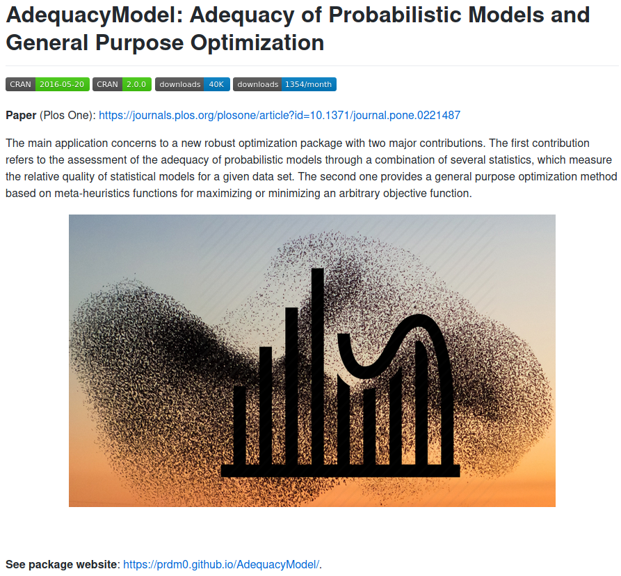

```{r xaringan-themer, include = FALSE}
# install.packages(c("xaringan", "devtools"))
# devtools::install_github("gadenbuie/xaringanthemer")
library(xaringanthemer)
mono_dark(
  base_color = "#FF7100",
  header_font_google = google_font("Josefin Sans"),
  text_font_google   = google_font("Barlow", "600", "600i"),
  code_font_google   = google_font("Droid Mono"),
)
```

background-position: 100% 0%
class: inverse, center, middle

# Um pouco sobre mim


---
background-image: url("img/logo-branca.png")
background-size: 100px
background-position: 100% 0%

# Minha formação

</br></br></br></br>

- Cursei o **bacharelado** em estatística no Departamento de Estatística - UFPB entre os anos de 2006 à 2010.</br></br></br>

--

- Cursei o **mestrado** em estatística no Departamento de Estatística - UFPE entre os anos de 2012 à 2014.</br></br></br>

--

- E finalmente cursei o **doutorado** também em estatística no Departamento Departamento de Estatística - UFPE entre os anos de 2014 à 2016.

---
background-image: url("img/logo-branca.png")
background-size: 100px
background-position: 100% 0%

# Minha formação

--

**MESTRADO**

--

No mestrado trabalhei desenvolvendo estratégias em inferência intervalar aplicadas à **modelos** de regressão utilizando métodos estatísticos computacionalmente intensivos. Fui orientado pelo Prof. Francisco Cribari Neto do Departamento de Estatística da UFPE.

--

Título da dissertação: **Estimadores Intervalares Sob Heteroscedasticidade de Forma Desconhecida Via Bootstrap Duplo**.

Link da dissertação: clique [**aqui**](https://www3.ufpe.br/ppge/images/dissertacoes/dissertacao130.pdf).

--

**DOUTORADO**

--

No doutorado desenvolvi trabalhos na área de probabilidade com foco na obtenção de novas famílias de distribuições de probabilidade. O trabalho concentrou-se no desenvolvimento de propriedades matemáticas (inferência estatística) dos **modelos** propostos bem como foi desenvolvido bibliotecas computacionais para uso da comunidade científica que trabalha na área de distribuições de probabilidade.

--

Título da tese: **Some New Families of Continuous Distributions**.


Link da tese: clique [**aqui**](https://www.ufpe.br/documents/39866/714959/tese020.pdf/6f867756-1954-4ea1-8b01-e9077c1bd7f2).

---
background-image: url("img/logo-branca.png")
background-size: 100px
background-position: 100% 0%

# Onde me encontrar?

.pull-left[
```{r fig.height=6, fig.width=6, eval=require('leaflet'), echo = FALSE}
library(leaflet)
leaflet() %>% addTiles() %>% 
  setView(
  -34.846199, -7.140400, zoom = 60,
  options = popupOptions(
    minWidth = 200,
    maxWidth = 200
  )
)
```
]

--

.fadeInLeft.animated[
Você poderá me encontrar de diversas formas:
.pull-right[
-  Indo ao meu encontro no Departamento de Estatística - DE, UFPB. Minha sala é a última sala do correto (lado direito), **sala 12**.
  
-  Enviando um e-mail para mim: **pedro.rafael.marinho@gmail.com**.
  
-  Me seguindo no **GitHub**. Acesse [**https://github.com/prdm0**](https://github.com/prdm0).

No meu perfil no **GitHub** você poderá ter acesso à diversas bibliotecas computacionais que desenvolvo e estão sobre os termos da licença **GNU General Public License**. Você também poderá encontrar alguns materiais de algumas disciplinas que leciono no curso de bacharelado em estatística da UFPB. Por exemplo, você poderá acessar o material da disciplina de [**Estatística Computacional**](https://prdm0.github.io/aulas_computacional).
]]

---
background-image: url("img/logo-branca.png")
background-size: 100px
background-position: 100% 0%

# Siga o Departamento de Estatística nas redes sociais

</br>
</br>

[`r icon::fa("link")` **Site do Departamento**: **http://www.de.ufpb.br/**](http://www.de.ufpb.br/)  
[`r icon::fa("instagram")` **@estatisticaufpb**](https://www.instagram.com/estatisticaufpb/)  
[`r icon::fa("twitter")` **@estatisticaufpb**](https://twitter.com/estatisticaufpb)  
[`r icon::fa("github")` **@de-ufpb**](https://github.com/de-ufpb) 


---
background-position: 100% 0%
class: inverse, center, middle

# Afinal, o que é estatística?

.fadeInDownBig.animated[
```{r, echo=FALSE, out.width="390px",  out.height="350px",fig.cap="",fig.show='hold',fig.align='center'}

```
]

---
background-image: url("img/white.jpg")
background-size: cover
class: inverse

# **Grande Esquema das Coisas**


.pull-left[
A estatística é a ciência que nos permite estudar fenômenos que contém algum grau de incerteza. </br></br>

As metodologias estatísticas são embasadas por meio da teoria das probabilidades.  </br></br>

Desejamos estudar características de uma população por meio de um modelo probabilístico $F(\pmb\theta)$, em que $\pmb\theta$ é um vetor de quantidade fixas e desconhecida que denominamos de **parâmetros**. </br></br>

]

--

.fadeInLeft.animated[
.pull-right[
```{r, echo=FALSE,out.width="900px",  out.height="350px",fig.cap="",fig.show='hold',fig.align='center'}

```
]]


---
background-image: url("img/white.jpg")
background-size: cover
class: inverse

# **Grande Esquema das Coisas**

.pull-left[
A estatística é a ciência que nos permite estudar fenômenos que contém algum grau de incerteza. </br></br>

As metodologias estatísticas são embasadas por meio da teoria das probabilidades.  </br></br>

Desejamos estudar características de uma população por meio de um modelo probabilístico $F(\pmb\theta)$, em que $\pmb\theta$ é um vetor de quantidade fixas e desconhecida que denominamos de **parâmetros**. </br></br>

]


.pull-right[
```{r, echo=FALSE,out.width="900px",  out.height="350px",fig.cap="",fig.show='hold',fig.align='center'}

```
]

---
background-image: url("img/white.jpg")
background-size: cover
class: inverse

# **Grande Esquema das Coisas**

.pull-left[
A estatística é a ciência que nos permite estudar fenômenos que contém algum grau de incerteza. </br></br>

As metodologias estatísticas são embasadas por meio da teoria das probabilidades.  </br></br>

Desejamos estudar características de uma população por meio de um modelo probabilístico $F(\pmb\theta)$, em que $\pmb\theta$ é um vetor de quantidade fixas e desconhecida que denominamos de **parâmetros**. </br></br>

]

.pull-right[
```{r, echo=FALSE,out.width="900px",  out.height="350px",fig.cap="",fig.show='hold',fig.align='center'}

```
]

---
background-image: url("img/logo-branca.png")
background-size: 100px
background-position: 100% 0%

# Modelos

--
.pull-left[
<blockquote>
All models are wrong but some are useful.
</blockquote>
.right[-- <cite>**George E. P. Box**</cite>]

]

--

.fadeInLeft.animated[
.pull-right[
```{r, echo=FALSE,out.width="430px", out.height="380px",fig.cap="George E. P. Box, estatístico britânico que trabalhou em diversas áras da estatística como controle estatístico de qualidade e séries temporais.",fig.show='hold',fig.align='center'}
knitr::include_graphics("img/box.png")
```
]]

---
background-image: url("img/white.jpg")
background-size: cover
class: inverse

# **Inferência**


.pull-left[
- Se uma amostra representa bem uma população e podemos considerar uma distribuição $F(\cdot)$ (um modelo), em que $F$ poderá modelar as observações amostrais (os dados), então poderemos inferir por meio dos dados e de $F$ características da população de interesse.

</br></br>

- Na inferência paramétrica, realizar inferência na população equivale a fazer inferência sobre os parâmetros que indexam o modelo $F$.

]

.fadeInLeft.animated[
.pull-right[
```{r, echo=FALSE,out.width="550px",  out.height="400px",fig.cap="",fig.show='hold',fig.align='center'}

```
]]


---
background-image: url("img/logo-branca.png")
background-size: 100px
background-position: 100% 0%

# Inferência 

A inferência estatística é composta por um conjunto de resultados estatísticos/matemáticos baseados na **Teoria das Probabilidades** que podem ser utilizados para realizar três coisas que normalmente são de interesse na estatística:

1. Realizar estimação **pontual**; </br></br>
2. Construir **intervalos** aleatórios; </br></br>
3. Testar **hipóteses**.

--

Vocês podem se perguntar: 

- Estimar o que? </br></br>
- Construir intervalor para quem? </br></br>
- Testar o que? </br></br>

--

.fadeInDownBig.animated[
**Resposta**: Queremos estimar os parâmetros, construir intervalos aleatórios para os parâmetros e testar alguma hipótese para os parâmetros. Lembre-se, realizar inferência para os parâmetros que indexam um modelo $F(\cdot)$ equivale equivale a fazer inferência para a população.
]

---
background-image: url("img/logo-branca.png")
background-size: 100px
background-position: 100% 0%

# Inferência

Os estimadores, intervalos e testes são construídos com base no modelo $F(\pmb \theta)$ e preferencialmente deverão satisfazer diversas propriedades inferenciais para que funcionem bem. Por exemplo, desejamos construir estimadores $\hat{\pmb \theta}$ que sejam **não-viesados** e **consistentes** para se estimar $\pmb \theta$. </br></br>

--

O desenvolvimento adequado desses estimadores, intervalos e testes normalmente se dará a custo de **muita matemática**. </br></br>

--

Porém, é **muito comum** nos depararmos com situações em que não conseguiremos obter matemáticamente algumas quantidades de interesse ou mesmo avaliar propriedades das estatísticas construídas. Nessas situações, deveremos recorrer à métodos computacionais que normalmente são **bastante intensivos**. Entre tais metodologias, na estatística é comum o uso de: </br></br>

???

Um bom estimador deverá ser:

1. Não viesado;
2. Consistente;
3. Suficiente: Se a distribuição condicional $f(X | T)$ independe de $\theta$;
4. Eficiente: menor EQM na classe de estimadores não viesados para $\theta$.

--

.fadeInDownBig.animated[
1. Métodos de **otimização não-linear**: métodos de Newton e quasi-Newton; </br></br>
2. Simulações de [**Monte Carlo**](https://prdm0.github.io/aulas_computacional/t%C3%B3picos-em-estat%C3%ADstica-computacional.html#monte-carlo); </br></br>
3. Métodos de reamostragem: [**jackknife e bootstrap**](https://prdm0.github.io/aulas_computacional/t%C3%B3picos-em-estat%C3%ADstica-computacional.html#bootstrap).
]

---
background-image: url("img/estudo.jpg")
background-size: cover
class: inverse

# Conhecimentos necessários para uma possível orientação

</br>

.font150[Para que o aluno possa ser orientado por mim é necessário que ele curse três disciplinas. São elas:] </br></br>

--


.fadeInDownBig.animated[
1. .font130[**Probabiliade**;] </br></br>
2. .font130[**Introdução à Programação em R**;] </br></br>
3. .font130[**Inferência Estatística**.]
]

---
background-position: 100% 0%
class: inverse, center, middle

# Pesquisas atuais

---
background-image: url("img/logo-branca.png")
background-size: 100px
background-position: 100% 0%

# Biblioteca AdequacyModel

.zoomInUp.animated[
```{r, echo=FALSE,out.width="600px",  out.height="440px",fig.cap="Repositório da biblioteca AdequacyModel no GitHub.",fig.show='hold',fig.align='center'}

```
]

---
background-image: url("img/logo-branca.png")
background-size: 100px
background-position: 100% 0%

# Biblioteca AdequacyModel

</br></br>

A biblioteca vem sendo melhorada e os próximos enfoques do desenvolvimento são:
</br></br>
--

.fadeInUpBig.animated[
1. Implementar nova(s) estatística(s) para teste de adequação de ajuste; </br></br>
2. Desenvolver nova(s) estatística(s) que poderão ser utilizada(s) como teste(s) de adequação de ajuste. A ideia é tentar conseguir formas de obter boas estatíticas de adequação de ajuste que funcionem em pequenas amostras; </br></br>
3. Melhorar o desempenho computacional da biblioteca usando **C/C++** por meio da API **Rcpp**.
]

---
background-image: url("img/logo-branca.png")
background-size: 100px
background-position: 100% 0%


.fadeInLeft.animated[
```{r, echo=FALSE,out.width="610px",  out.height="600px",fig.cap="Publicação recente na Revista Plos One.",fig.show='hold',fig.align='center'}

```
]

---
background-image: url("img/logo-branca.png")
background-size: 100px
background-position: 100% 0%


</br></br>

.fadeInRight.animated[
```{r, echo=FALSE,out.width="900px",  out.height="500px",fig.cap="Função de Rastring (a) e Himmelblau's (b).",fig.show='hold',fig.align='center'}

```
]

---
background-image: url("img/logo-branca.png")
background-size: 100px
background-position: 100% 0%

# Função `pso()` do pacote AdequacyModel

</br></br>

.center[
.zoomInUp.animated[
```{r, echo = FALSE, out.height="350px", out.height="380px", fig.align='center', fig.cap="Função Easom."}
library("htmltools")
library("vembedr")
embed_url("https://www.youtube.com/watch?v=qfRbX54RHf4")
```
]]
</br>

.center[
Animação do funcionamento da função `pso()` do pacote **AdequacyModel** minimizando a função Easom ["ver"](https://www.sfu.ca/~ssurjano/easom.html).
]


---
background-image: url("img/logo-branca.png")
background-size: 100px
background-position: 100% 0%

# Outras ferramentas utilizam o AdequacyModel

</br></br>

- Outras bibliotecas estatísticas dependem do pacote **AdequacyModel**, como por exemplo a biblioteca **Newdistns** publicada pelo **Saralees Nadarajah** e que originou um paper publicado no **Journal Statistical Software Software - JSS**. </br></br>

--

- No último mês houve mais de **1300** download do pacote. </br></br>

--

- Outras bibliotecas que dependem do **AdequacyModel** é a **Wrapped** desenvolvida por Yuanyuan Zhang e Saraless Nadarajah e que originou um paper publicado na revista Plos One. </br></br>

--

- Uma outra biblioteca de nome **sglg** também utiliza o **AdequacyModel** em sua implementação.

---
background-position: 100% 0%
class: inverse, center, middle

# Melhorando o procedimento de teste da razão de verossimilhança em pequenas amostras

---
background-image: url("img/logo-branca.png")
background-size: 100px
background-position: 100% 0%

# Modelos de probabilidade generalizados sup e inf

Dado uma modelo probabilístico $G$ (modelo base), é possível obter modelos generelizados como os modelos $G_c^{\mbox{sup}}$ e $G_c^{\mbox{inf}}$.

.fadeInLeft.animated[
```{r, echo=FALSE, out.width="400px", out.height="350px", fig.cap="",fig.show='hold',fig.align='center'}

```
]

---
background-image: url("img/logo-branca.png")
background-size: 100px
background-position: 100% 0%

# Modelos de probabilidade generalizados sup e inf

</br>

\begin{align*}
 H_0: \theta\in\Theta_0\quad \mbox{versus} \quad H_1: H_0\  \mbox{é falsa}
\end{align*}

Um  procedimento comumente usado é o Teste da Razão de Verossimilhanças (TRV)  que consiste  em aceitar ou rejeitar a hipótese nula $H_0$ com base em um conjunto de observações (amostra). O TRV faz uso de uma estatística $\hat{\lambda}$ definida por

$$\hat{\lambda} = -2\ln\Big[\frac{L(\theta_0|\pmb x)}{L(\hat{\pmb\theta}|\pmb x)}\Big],$$
em que $L(\cdot)$ é uma função que denominamos de [**função de verossimilhança**](http://mathworld.wolfram.com/Log-LikelihoodFunction.html).
</br>

Existe um resultado que garante que, quando o tamanho $n$ da amostra é grande, então podemos usar a distribuição qui-quadrado $\chi^2$ para definir a região crítica do TRV, pelo menos aproximadamente.

--

.font130[**Problema**: quando o tamanho da amostra é pequeno, o TRV pode levar a inferências imprecisas.]


---
background-image: url("img/logo-branca.png")
background-size: 100px
background-position: 100% 0%

# Modelos de probabilidade generalizados sup e inf

.font130[**Idéia**: Usar as propriedades do modelo qui-quadrado inf para obter um aperfeiçoamento do Teste da Razão de Verossimilhanças (TRV) quando o tamanho da amostra $n$ é pequeno.]
 
</br></br>

A proposta da pesquisa é propor uma correção não na estatística $RV$, como acontece nas correções usuais, mas sim na distribuição qui-quadrado $\chi^2$. A correção consiste em considerar a nova distribuição qui-quadrado inf $\chi^2_{inf}$ para modificar a região crítica do TRV, conduzindo a resultados inferenciais mais acurados quando $n$ de pequeno a moderado.

</br></br>
 
A nova metodologia é consistente no sentido que $\chi^2_{inf} \longrightarrow \chi^2$ quando $n\rightarrow \infty$.

---
background-image: url("img/logo-branca.png")
background-size: 100px
background-position: 100% 0%
class: middle, center

.fadeInDownBig.animated[
# Obrigado pela sua atenção!
]